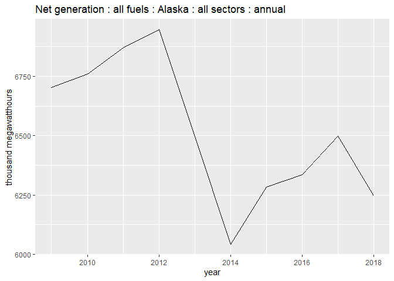

<!-- README.md is generated from README.Rmd. Please edit that file -->

# eia 

**Author:** [Matthew Leonawicz](https://github.com/leonawicz)
<a href="https://orcid.org/0000-0001-9452-2771" target="orcid.widget">
<image class="orcid" src="https://members.orcid.org/sites/default/files/vector_iD_icon.svg" height="16"></a>
<br/> **License:** [MIT](https://opensource.org/licenses/MIT)<br/>

[](https://www.repostatus.org/#active)
[](https://travis-ci.org/ropensci/eia)
[](https://ci.appveyor.com/project/leonawicz/eia)
[](https://codecov.io/gh/ropensci/eia?branch=master)

[](https://github.com/ropensci/software-review/issues/342)
[](https://cran.r-project.org/package=eia)
[](https://cran.r-project.org/package=eia)
[](https://github.com/ropensci/eia/)

The `eia` package provides API access to data from the US [Energy
Information Administration](https://www.eia.gov/) (EIA).

Pulling data from the US Energy Information Administration (EIA) API
requires a registered API key. A key can be obtained at no cost
[here](https://www.eia.gov/opendata/register.php). A valid email and
agreement to the API Terms of Service is required to obtain a key.

`eia` includes functions for searching EIA API data categories and
importing time series and geoset time series datasets. Datasets returned
by these functions are provided in a tidy format or alternatively in
more raw form. It also offers helper functions for working with EIA API
date strings and time formats and for inspecting different summaries of
series metadata. The package also provides control over API key storage
and caching of API request results.

## Installation

Install the CRAN release of `eia` with

``` r
install.packages("eia")
```

To install the development version from GitHub use

``` r
# install.packages("remotes")
remotes::install_github("ropensci/eia")
```

## Example

To begin, store your API key. You can place it somewhere like your
`.Renviron` file and never have to do anything with the key when you use
the package. You can set it with `eia_set_key` in your R session. You
can always pass it explicitly to the `key` argument of a function.

``` r
library(eia)

# not run
eia_set_key("yourkey") # set API key if not already set globally
```

Load a time series of net electricity generation.

``` r
id <- "ELEC.GEN.ALL-AK-99.A"
(d <- eia_series(id, n = 10))
#> # A tibble: 1 x 13
#>   series_id     name                     units       f     description                       copyright source              iso3166 geography start end   updated      data     
#>   <chr>         <chr>                    <chr>       <chr> <chr>                             <chr>     <chr>               <chr>   <chr>     <chr> <chr> <chr>        <list>   
#> 1 ELEC.GEN.ALL~ Net generation : all fu~ thousand m~ A     "Summation of all fuels used for~ None      EIA, U.S. Energy I~ USA-AK  USA-AK    2001  2019  2020-10-27T~ <tibble ~

d$data[[1]]
#> # A tibble: 10 x 3
#>    value date        year
#>    <dbl> <date>     <int>
#>  1 6071. 2019-01-01  2019
#>  2 6247. 2018-01-01  2018
#>  3 6497. 2017-01-01  2017
#>  4 6335. 2016-01-01  2016
#>  5 6285. 2015-01-01  2015
#>  6 6043. 2014-01-01  2014
#>  7 6497. 2013-01-01  2013
#>  8 6946. 2012-01-01  2012
#>  9 6871. 2011-01-01  2011
#> 10 6760. 2010-01-01  2010

library(ggplot2)
library(tidyr)
unnest(d, cols = data) %>% ggplot(aes(factor(year), value)) + geom_col() + 
  labs(x = "Year", y = d$units, title = d$name, caption = d$description)
```



## References

See the collection of vignette tutorials and examples as well as
complete package documentation available at the `eia` package
[website](https://docs.ropensci.org/eia/).

-----

Please note that the `eia` project is released with a [Contributor Code
of
Conduct](https://github.com/ropensci/eia/blob/master/CODE_OF_CONDUCT.md).
By contributing to this project, you agree to abide by its terms.

[](https://ropensci.org)
