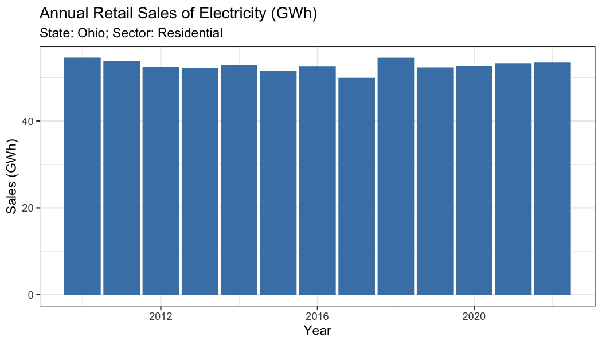

<!-- README.md is generated from README.Rmd. Please edit that file -->

# eia 

<!-- badges: start -->

[](https://www.repostatus.org/)
[](https://github.com/ropensci/eia/actions/workflows/R-CMD-check.yaml)
[](https://app.codecov.io/gh/ropensci/eia?branch=master)
[](https://cran.r-project.org/package=eia)
[](https://cran.r-project.org/package=eia)
[](https://github.com/ropensci/eia)
<!-- badges: end -->

The `eia` package provides API access to data from the US [Energy
Information Administration](https://www.eia.gov/) (EIA).

Pulling data from the US Energy Information Administration (EIA) API
requires a registered API key. A key can be obtained at no cost
[here](https://www.eia.gov/opendata/register.php). A valid email and
agreement to the API Terms of Service is required to obtain a key.

`eia` includes functions for searching the EIA API data directory and
importing various datasets. Datasets returned by these functions are
provided in a tidy format or alternatively in more raw form. It also
offers helper functions for working with EIA API date strings and time
formats and for inspecting different summaries of data metadata. The
package also provides control over API key storage and caching of API
request results.

## Installation

Install the CRAN release of `eia` with

``` r
install.packages("eia")
```

or install the development version from GitHub with

``` r
# install.packages("remotes")
remotes::install_github("ropensci/eia")
```

## Example

After obtaining the API key, store it somewhere such as `.Renviron` and
never have to do anything with the key when using the package.
Alternatively, set it manually with `eia_set_key()` in the current R
session. Further, it can always be passed explicitly to the `key`
argument of a given `eia` function.

### Load package and set key

``` r
library(eia)

# not run
eia_set_key("yourkey") # set API key if not already set globally
```

### Explore the API directory

Get a list of the EIA’s data directory (and sub-directories) with
`eia_dir()`.

``` r
# Top-level directory
eia_dir()
#> # A tibble: 14 × 3
#>    id                name                            description                
#>    <chr>             <chr>                           <chr>                      
#>  1 coal              Coal                            EIA coal energy data       
#>  2 crude-oil-imports Crude Oil Imports               Crude oil imports by count…
#>  3 electricity       Electricity                     EIA electricity survey data
#>  4 international     International                   Country level production, …
#>  5 natural-gas       Natural Gas                     EIA natural gas survey data
#>  6 nuclear-outages   Nuclear Outages                 EIA nuclear outages survey…
#>  7 petroleum         Petroleum                       EIA petroleum gas survey d…
#>  8 seds              State Energy Data System (SEDS) Estimated production, cons…
#>  9 steo              Short Term Energy Outlook       Monthly short term (18 mon…
#> 10 densified-biomass Densified Biomass               EIA densified biomass data 
#> 11 total-energy      Total Energy                    These data represent the m…
#> 12 aeo               Annual Energy Outlook           Annual U.S. projections us…
#> 13 ieo               International Energy Outlook    Annual international proje…
#> 14 co2-emissions     State CO2 Emissions             EIA CO2 Emissions data

# Electricity sub-directory
eia_dir("electricity")
#> # A tibble: 6 × 3
#>   id                              name                 description              
#>   <chr>                           <chr>                <chr>                    
#> 1 retail-sales                    Electricity Sales t… "Electricity sales to ul…
#> 2 electric-power-operational-data Electric Power Oper… "Monthly and annual elec…
#> 3 rto                             Electric Power Oper… "Hourly and daily electr…
#> 4 state-electricity-profiles      State Specific Data  "State Specific Data"    
#> 5 operating-generator-capacity    Inventory of Operab… "Inventory of operable g…
#> 6 facility-fuel                   Electric Power Oper… "Annual and monthly elec…
```

### Get data

Get annual retail electric sales for the Ohio residential sector since
2010

``` r
(d <- eia_data(
  dir = "electricity/retail-sales",
  data = "sales",
  facets = list(stateid = "OH", sectorid = "RES"),
  freq = "annual",
  start = "2010",
  sort = list(cols = "period", ordr = "asc"),
))
#> # A tibble: 13 × 7
#>    period stateid stateDescription sectorid sectorName   sales `sales-units`    
#>     <int> <chr>   <chr>            <chr>    <chr>        <dbl> <chr>            
#>  1   2010 OH      Ohio             RES      residential 54474. million kilowatt…
#>  2   2011 OH      Ohio             RES      residential 53687. million kilowatt…
#>  3   2012 OH      Ohio             RES      residential 52288. million kilowatt…
#>  4   2013 OH      Ohio             RES      residential 52158. million kilowatt…
#>  5   2014 OH      Ohio             RES      residential 52804. million kilowatt…
#>  6   2015 OH      Ohio             RES      residential 51493. million kilowatt…
#>  7   2016 OH      Ohio             RES      residential 52524. million kilowatt…
#>  8   2017 OH      Ohio             RES      residential 49796. million kilowatt…
#>  9   2018 OH      Ohio             RES      residential 54452. million kilowatt…
#> 10   2019 OH      Ohio             RES      residential 52226. million kilowatt…
#> 11   2020 OH      Ohio             RES      residential 52553. million kilowatt…
#> 12   2021 OH      Ohio             RES      residential 53171. million kilowatt…
#> 13   2022 OH      Ohio             RES      residential 53312. million kilowatt…
```

and make a nice plot.

``` r
library(ggplot2)
ggplot(d, aes(x = period, y = sales / 1e3)) +
  geom_bar(col = "steelblue", fill = "steelblue", stat = "identity") +
  theme_bw() +
  labs(
    title = "Annual Retail Sales of Electricity (GWh)",
    subtitle = "State: Ohio; Sector: Residential",
    x = "Year", y = "Sales (GWh)"
  )
```



## References

See the collection of vignette tutorials and examples as well as
complete package documentation available at the `eia` package
[website](https://docs.ropensci.org/eia/).

------------------------------------------------------------------------

Please note that the `eia` project is released with a [Contributor Code
of
Conduct](https://github.com/ropensci/eia/blob/master/CODE_OF_CONDUCT.md).
By contributing to this project, you agree to abide by its terms.

[](https://ropensci.org)
