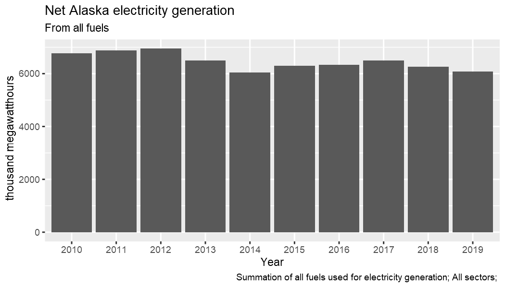
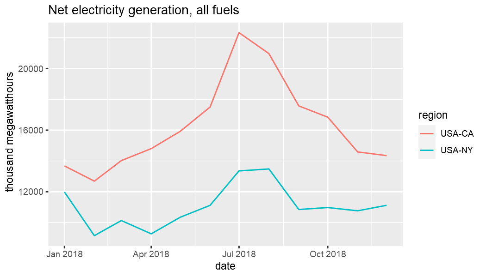
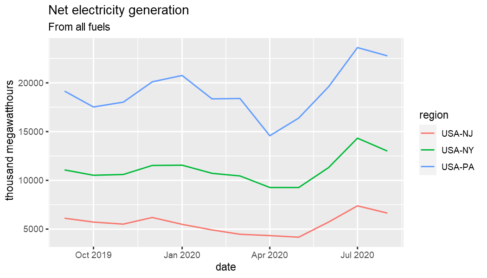

This vignette provides a brief overview of the most important functions in `eia`. Other vignettes go into greater depth on specific topics and API endpoints.

## API key

### Register a key with EIA

Obtaining an API key is easy and free.

Pulling data from the US Energy Information Administration (EIA) API requires a registered API key. A key can be obtained at no cost [here](https://www.eia.gov/opendata/register.php). A valid email and agreement to the API Terms of Service is required to obtain a key.

It is important to store your API key somewhere secure. Do not commit it to a repository or otherwise share it. For example, you could store it in your `.Renviron` file.

### Key storage and retrieval

You can always provide the `key` argument to every API function call, but you do not have to. There are getter and setter helpers available to make using `eia` functions a more seamless experience.

`eia_set_key` gives you the option of storing your key for the duration of your R session.


```r
library(eia)
# eia_set_key("yourkey")
# eia_get_key() # retrieve it
```

If the key already exists in the system environment and you plan to pass `key` to functions explicitly, you could start as follows.


```r
key <- Sys.getenv("EIA_KEY")

# or:
key <- eia_get_key()
```

In general, however, if your key is set globally such as in `.Renviron`, you do not need to do anything regarding the key when you use the package. See the vignette on API details for more information about all the options you have for key storage.

## EIA categories

Once you have your EIA registered API key and have it in place for your R session by whichever method you prefer, you are ready to begin accessing data from the EIA API.

It is helpful to be aware of various categories of data that are available. Each category has a unique ID number that is required to access associated data. The first call below does not include an ID. The result is a list of two data frames. The first is metadata associated with that position in the category hierarchy. The second is the child category information.

Here is the top-level category information.


```r
eia_cats()
#> $category
#> # A tibble: 1 x 3
#>   category_id name          notes
#>   <chr>       <chr>         <chr>
#> 1 371         EIA Data Sets ""   
#> 
#> $childcategories
#> # A tibble: 13 x 2
#>    category_id name                               
#>          <int> <chr>                              
#>  1           0 Electricity                        
#>  2       40203 State Energy Data System (SEDS)    
#>  3      714755 Petroleum                          
#>  4      714804 Natural Gas                        
#>  5      711224 Total Energy                       
#>  6      717234 Coal                               
#>  7      829714 Short-Term Energy Outlook          
#>  8     1292190 Crude Oil Imports                  
#>  9     2123635 U.S. Electric System Operating Data
#> 10     2134384 International Energy Data          
#> 11     2251604 CO2 Emissions                      
#> 12     2631064 International Energy Outlook       
#> 13     2889994 U.S. Nuclear Outages
```

The child category IDs can be used to query results from that category.


```r
eia_cats(0)
#> $category
#> # A tibble: 1 x 4
#>   category_id parent_category_id name        notes
#>   <chr>       <chr>              <chr>       <chr>
#> 1 0           371                Electricity ""   
#> 
#> $childcategories
#> # A tibble: 19 x 2
#>    category_id name                                                        
#>          <int> <chr>                                                       
#>  1           1 Net generation                                              
#>  2          35 Total consumption                                           
#>  3          32 Total consumption (Btu)                                     
#>  4          36 Consumption for electricity generation                      
#>  5          33 Consumption for electricity generation (Btu)                
#>  6          37 Consumption for useful thermal output                       
#>  7          34 Consumption for useful thermal output (Btu)                 
#>  8        1017 Plant level data                                            
#>  9          38 Retail sales of electricity                                 
#> 10          39 Revenue from retail sales of electricity                    
#> 11          40 Average retail price of electricity                         
#> 12     1718389 Number of customer accounts                                 
#> 13       41137 Fossil-fuel stocks for electricity generation               
#> 14       41138 Receipts of fossil fuels by electricity plants              
#> 15       41139 Receipts of fossil fuels by electricity plants (Btu)        
#> 16       41140 Average cost of fossil fuels for electricity generation     
#> 17       41141 Average cost of fossil fuels for electricity generation (pe~
#> 18       41142 Quality of fossil fuels in electricity generation : sulfur ~
#> 19       41143 Quality of fossil fuels in electricity generation : ash con~
```

## EIA time series data

Time series data is obtained by series ID. Most columns contain metadata. The `data` column contains the time series data.


```r
library(dplyr)
library(tidyr)
library(ggplot2)

id <- "ELEC.GEN.ALL-AK-99.A"
(x <- eia_series(id))
#> # A tibble: 1 x 13
#>   series_id name  units f     description copyright source iso3166
#>   <chr>     <chr> <chr> <chr> <chr>       <chr>     <chr>  <chr>  
#> 1 ELEC.GEN~ Net ~ thou~ A     "Summation~ None      EIA, ~ USA-AK 
#> # ... with 5 more variables: geography <chr>, start <chr>, end <chr>,
#> #   updated <chr>, data <list>

x$data[[1]]
#> # A tibble: 18 x 3
#>    value date        year
#>    <dbl> <date>     <int>
#>  1 6247. 2018-01-01  2018
#>  2 6497. 2017-01-01  2017
#>  3 6335. 2016-01-01  2016
#>  4 6285. 2015-01-01  2015
#>  5 6043. 2014-01-01  2014
#>  6 6497. 2013-01-01  2013
#>  7 6946. 2012-01-01  2012
#>  8 6871. 2011-01-01  2011
#>  9 6760. 2010-01-01  2010
#> 10 6702. 2009-01-01  2009
#> 11 6775. 2008-01-01  2008
#> 12 6821. 2007-01-01  2007
#> 13 6674. 2006-01-01  2006
#> 14 6577. 2005-01-01  2005
#> 15 6527. 2004-01-01  2004
#> 16 6339. 2003-01-01  2003
#> 17 6767. 2002-01-01  2002
#> 18 6744. 2001-01-01  2001

select(x, units, data) %>% unnest(cols = data) %>%
  ggplot(aes(date, value)) + geom_line() +
  labs(y = x$units[1], title = "Net electricity generation, Alaska, all fuels")
```



You can provide arguments like the following:


```r
eia_series(id) # max results
eia_series(id, n = 5) # most recent five
eia_series(id, end = 2016, n = 5) # ending in 2016
eia_series(id, start = 2000, end = 2016) # specific period
```

As with `eia_cats`, the output format does not need to be tidy:


```r
eia_series(id, n = 5, tidy = FALSE) # results of jsonlite::fromJSON
eia_series(id, n = 5, tidy = NA) # origina JSON as character string
```

This allows you to use the returned results with existing code you may have that requires data in one of these less processed structures.

## EIA geosets

Geosets are metadata structures organizing time series datasets that can be mapped. Arguments to `eia_geoset` are the same as `eia_series` with the addition of `region`. Like `id`, `region` can be a vector. Most of the details are the same as before.

In the example below using total electricity generation, get the last two data points for each of and two US states. `dplyr` and `tidyr` are used here to clean up the result a bit for purposes of display. `gpplot2` is used to graph the data after it has been unnested for each state.


```r
id <- c("ELEC.GEN.ALL-99.M") # monthly
region <- c("USA-CA", "USA-NY")
(x <- eia_geoset(id, region, start = "201801", end = "201812"))
#> # A tibble: 2 x 11
#>   geoset_id setname f     units series_id name  region latlon start end  
#>   <chr>     <chr>   <chr> <chr> <chr>     <chr> <chr>  <chr>  <chr> <chr>
#> 1 ELEC.GEN~ Net ge~ M     thou~ ELEC.GEN~ Net ~ USA-CA <NA>   2001~ 2019~
#> 2 ELEC.GEN~ Net ge~ M     thou~ ELEC.GEN~ Net ~ USA-NY <NA>   2001~ 2019~
#> # ... with 1 more variable: data <list>

select(x, region, data) %>% unnest(cols = data)
#> # A tibble: 24 x 5
#>    region  value date        year month
#>    <chr>   <dbl> <date>     <int> <int>
#>  1 USA-CA 14346. 2018-12-01  2018    12
#>  2 USA-CA 14587. 2018-11-01  2018    11
#>  3 USA-CA 16844. 2018-10-01  2018    10
#>  4 USA-CA 17574. 2018-09-01  2018     9
#>  5 USA-CA 20972. 2018-08-01  2018     8
#>  6 USA-CA 22332. 2018-07-01  2018     7
#>  7 USA-CA 17500. 2018-06-01  2018     6
#>  8 USA-CA 15922. 2018-05-01  2018     5
#>  9 USA-CA 14800. 2018-04-01  2018     4
#> 10 USA-CA 14024. 2018-03-01  2018     3
#> # ... with 14 more rows

unnest(x, cols = data) %>%
  ggplot(aes(date, value, color = region)) +
  geom_line() +
  labs(y = x$units[1], title = "Net electricity generation, all fuels")
```



Another convenience of `eia_geoset` is the ability to provide regions in the following forms.

* 2-character US state abbreviations
* State names
* US Census region names
* US census division names

These shortcuts make it easier to construct an API call involving several states.


```r
region <- c("AK", "New England")
x <- eia_geoset(id, region, n = 2)
select(x, region, data) %>% unnest(cols = data)
#> # A tibble: 14 x 5
#>    region value date        year month
#>    <chr>  <dbl> <date>     <int> <int>
#>  1 USA-AK  640. 2019-08-01  2019     8
#>  2 USA-AK  690. 2019-07-01  2019     7
#>  3 USA-CT 3855. 2019-08-01  2019     8
#>  4 USA-CT 4089. 2019-07-01  2019     7
#>  5 USA-MA 1987. 2019-08-01  2019     8
#>  6 USA-MA 2585. 2019-07-01  2019     7
#>  7 USA-ME  801. 2019-08-01  2019     8
#>  8 USA-ME  940. 2019-07-01  2019     7
#>  9 USA-NH 1711. 2019-08-01  2019     8
#> 10 USA-NH 1870. 2019-07-01  2019     7
#> 11 USA-RI  866. 2019-08-01  2019     8
#> 12 USA-RI  807. 2019-07-01  2019     7
#> 13 USA-VT  161. 2019-08-01  2019     8
#> 14 USA-VT  200. 2019-07-01  2019     7

region <- "Middle Atlantic"
x <- eia_geoset(id, region, n = 12)
select(x, region, data) %>% unnest(cols = data)
#> # A tibble: 36 x 5
#>    region value date        year month
#>    <chr>  <dbl> <date>     <int> <int>
#>  1 USA-NJ 6872. 2019-08-01  2019     8
#>  2 USA-NJ 7505. 2019-07-01  2019     7
#>  3 USA-NJ 5803. 2019-06-01  2019     6
#>  4 USA-NJ 4916. 2019-05-01  2019     5
#>  5 USA-NJ 5486. 2019-04-01  2019     4
#>  6 USA-NJ 5575. 2019-03-01  2019     3
#>  7 USA-NJ 5645. 2019-02-01  2019     2
#>  8 USA-NJ 6044. 2019-01-01  2019     1
#>  9 USA-NJ 5952. 2018-12-01  2018    12
#> 10 USA-NJ 5183. 2018-11-01  2018    11
#> # ... with 26 more rows

unnest(x, cols = data) %>%
  ggplot(aes(date, value, color = region)) +
  geom_line() +
  labs(y = x$units[1], title = "Net electricity generation, all fuels")
```



Even more convenient is that these names are available in R. See the `datasets::state.*` functions and the geoset vignette.
