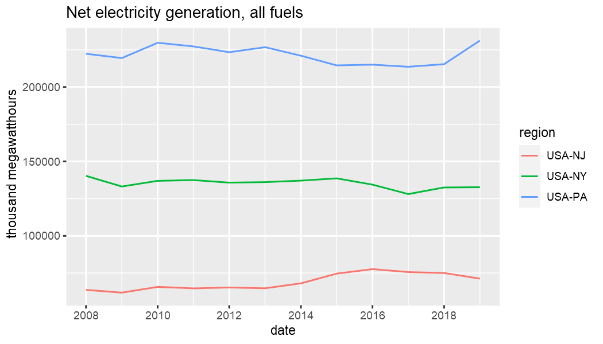

## Time series by region

Geosets are metadata structures relating series together. Requesting series using the `geoset` API endpoint is much the same as requesting series data using the `series` endpoint. Instead of `eia_series`, use `eia_geoset`.

The main difference is that you must provide a geoset ID to `id` and a `region` argument. Both may be vectors of multiple series and regions. The function returns the combination of time series datasets and regions that exist. The API will not return all geographic entities associated with a geoset. You are required to specify which region(s) you want and they must be associated with the given geoset ID.


```r
library(eia)
library(dplyr)
library(tidyr)
library(ggplot2)

# eia_set_key("yourkey") # set API key if not already set globally
id <- "ELEC.GEN.ALL-99.A"
region <- c("USA-CA", "USA-NY")
(x <- eia_geoset(id, region[1], n = 3))
#> # A tibble: 1 x 11
#>   geoset_id      setname                        f     units           series_id      name                                region latlon start end   data      
#> * <chr>          <chr>                          <chr> <chr>           <chr>          <chr>                               <chr>  <chr>  <chr> <chr> <list>    
#> 1 ELEC.GEN.ALL-~ Net generation : all fuels : ~ A     thousand megaw~ ELEC.GEN.ALL-~ Net generation : all fuels : Calif~ USA-CA <NA>   2001  2019  <tibble [~
```

## Groups of regions

If you want data for all fifty states for example, you can set `region = "USA"`; you do not need to make a vector of all fifty state IDs. However, if you want certain region subsets, there are other options besides making a vector of these values. For example, the `eia_geoset` accepts shorthand descriptions of specific, popular subsets of states; so popular in fact that their labels ship with R itself in the `datasts` package.

You can provide simple state abbreviations (without the `USA-` prefix), state names, and more to the point, US Census regions and divisions. These are two hierarchical sets of US states.


```r
tibble(state.abb, state.name, state.region, state.division)
#> # A tibble: 50 x 4
#>    state.abb state.name  state.region state.division    
#>    <chr>     <chr>       <fct>        <fct>             
#>  1 AL        Alabama     South        East South Central
#>  2 AK        Alaska      West         Pacific           
#>  3 AZ        Arizona     West         Mountain          
#>  4 AR        Arkansas    South        West South Central
#>  5 CA        California  West         Pacific           
#>  6 CO        Colorado    West         Mountain          
#>  7 CT        Connecticut Northeast    New England       
#>  8 DE        Delaware    South        South Atlantic    
#>  9 FL        Florida     South        South Atlantic    
#> 10 GA        Georgia     South        South Atlantic    
#> # ... with 40 more rows
```

Provide the associated label and `eia_geoset` recognizes subsets of US states. Even this can be a vector. In the example below, `region` consists of Alaska plus the states belonging to the New England census division.


```r

(x <- eia_geoset(id, c("AK", "New England"), n = 1))
#> # A tibble: 7 x 11
#>   geoset_id      setname                       f     units          series_id       name                                 region latlon start end   data      
#> * <chr>          <chr>                         <chr> <chr>          <chr>           <chr>                                <chr>  <chr>  <chr> <chr> <list>    
#> 1 ELEC.GEN.ALL-~ Net generation : all fuels :~ A     thousand mega~ ELEC.GEN.ALL-A~ Net generation : all fuels : Alaska~ USA-AK <NA>   2001  2019  <tibble [~
#> 2 ELEC.GEN.ALL-~ Net generation : all fuels :~ A     thousand mega~ ELEC.GEN.ALL-C~ Net generation : all fuels : Connec~ USA-CT <NA>   2001  2019  <tibble [~
#> 3 ELEC.GEN.ALL-~ Net generation : all fuels :~ A     thousand mega~ ELEC.GEN.ALL-M~ Net generation : all fuels : Massac~ USA-MA <NA>   2001  2019  <tibble [~
#> 4 ELEC.GEN.ALL-~ Net generation : all fuels :~ A     thousand mega~ ELEC.GEN.ALL-M~ Net generation : all fuels : Maine ~ USA-ME <NA>   2001  2019  <tibble [~
#> 5 ELEC.GEN.ALL-~ Net generation : all fuels :~ A     thousand mega~ ELEC.GEN.ALL-N~ Net generation : all fuels : New Ha~ USA-NH <NA>   2001  2019  <tibble [~
#> 6 ELEC.GEN.ALL-~ Net generation : all fuels :~ A     thousand mega~ ELEC.GEN.ALL-R~ Net generation : all fuels : Rhode ~ USA-RI <NA>   2001  2019  <tibble [~
#> 7 ELEC.GEN.ALL-~ Net generation : all fuels :~ A     thousand mega~ ELEC.GEN.ALL-V~ Net generation : all fuels : Vermon~ USA-VT <NA>   2001  2019  <tibble [~
x$data[[1]]
#> # A tibble: 1 x 3
#>   value date        year
#>   <dbl> <date>     <int>
#> 1 6340. 2019-01-01  2019

region <- "Middle Atlantic"
x <- eia_geoset(id, region, n = 12)
select(x, region, data) %>% unnest(cols = data)
#> # A tibble: 36 x 4
#>    region  value date        year
#>    <chr>   <dbl> <date>     <int>
#>  1 USA-NJ 71230. 2019-01-01  2019
#>  2 USA-NJ 75034. 2018-01-01  2018
#>  3 USA-NJ 75645. 2017-01-01  2017
#>  4 USA-NJ 77611. 2016-01-01  2016
#>  5 USA-NJ 74609. 2015-01-01  2015
#>  6 USA-NJ 68051. 2014-01-01  2014
#>  7 USA-NJ 64751. 2013-01-01  2013
#>  8 USA-NJ 65263. 2012-01-01  2012
#>  9 USA-NJ 64694. 2011-01-01  2011
#> 10 USA-NJ 65682. 2010-01-01  2010
#> # ... with 26 more rows

unnest(x, cols = data) %>%
  ggplot(aes(date, value, color = region)) +
  geom_line() +
  labs(y = x$units[1], title = "Net electricity generation, all fuels")
```



## Relations

There is also a `relation` argument that accepts an optional relation ID. If one is provided, `eia_geoset` will switch to the API `relation` endpoint. A relation is another metadata structure that applies to geosets and relates summary statistics associated with geoset IDs to their composite statistics. This makes it easier to obtain variables that facet the data, e.g., by sector or fuel type.

The EIA `relation` API endpoint is officially supported according to the online EIA API documentation, but unfortunately that endpoint does not appear to function at the time of current package release.
