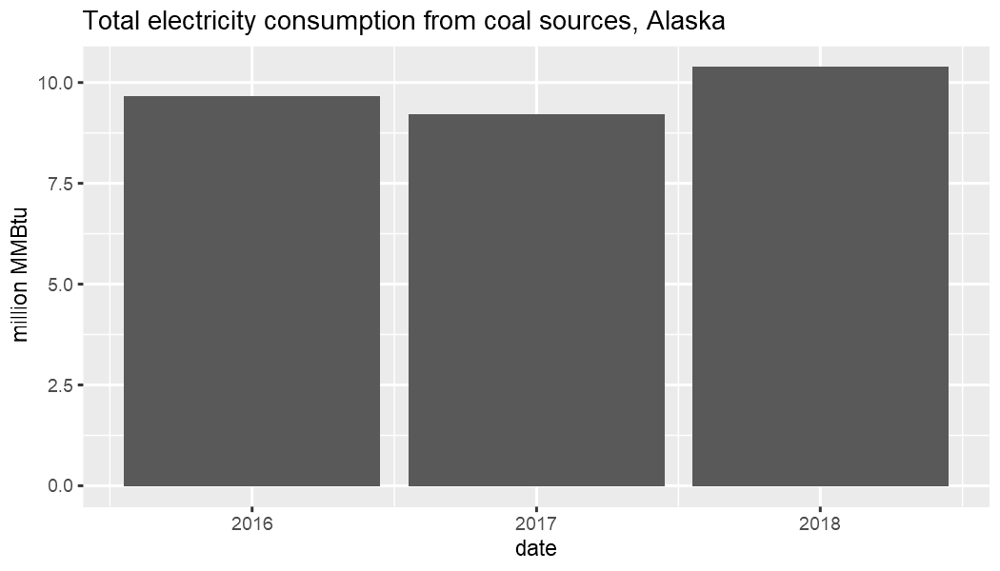

## Finding the desired data series

Like category information, time series data is obtained based on its ID. A complete example includes finding the ID for the series if you do not already know it. Chances are you may already know the series IDs you need after using the API explorer on the EIA website. Below, look for total electricity consumption.

```r
library(eia)
# eia_set_key("yourkey") # set API key if not already set globally
eia_cats()
#> $category
#> # A tibble: 1 x 3
#>   category_id name          notes
#>   <chr>       <chr>         <chr>
#> 1 371         EIA Data Sets ""   
#> 
#> $childcategories
#> # A tibble: 14 x 2
#>    category_id name                               
#>          <int> <chr>                              
#>  1           0 Electricity                        
#>  2       40203 State Energy Data System (SEDS)    
#>  3      714755 Petroleum                          
#>  4      714804 Natural Gas                        
#>  5      711224 Total Energy                       
#>  6      717234 Coal                               
#>  7      829714 Short-Term Energy Outlook          
#>  8      964164 Annual Energy Outlook              
#>  9     1292190 Crude Oil Imports                  
#> 10     2123635 U.S. Electric System Operating Data
#> 11     2134384 International Energy Data          
#> 12     2251604 CO2 Emissions                      
#> 13     2631064 International Energy Outlook       
#> 14     2889994 U.S. Nuclear Outages
```

Electricity has category ID 0. Take a closer look there.


```r
eia_cats(0)
#> $category
#> # A tibble: 1 x 4
#>   category_id parent_category_id name        notes
#>   <chr>       <chr>              <chr>       <chr>
#> 1 0           371                Electricity ""   
#> 
#> $childcategories
#> # A tibble: 19 x 2
#>    category_id name                                                              
#>          <int> <chr>                                                             
#>  1           1 Net generation                                                    
#>  2          35 Total consumption                                                 
#>  3          32 Total consumption (Btu)                                           
#>  4          36 Consumption for electricity generation                            
#>  5          33 Consumption for electricity generation (Btu)                      
#>  6          37 Consumption for useful thermal output                             
#>  7          34 Consumption for useful thermal output (Btu)                       
#>  8        1017 Plant level data                                                  
#>  9          38 Retail sales of electricity                                       
#> 10          39 Revenue from retail sales of electricity                          
#> 11          40 Average retail price of electricity                               
#> 12     1718389 Number of customer accounts                                       
#> 13       41137 Fossil-fuel stocks for electricity generation                     
#> 14       41138 Receipts of fossil fuels by electricity plants                    
#> 15       41139 Receipts of fossil fuels by electricity plants (Btu)              
#> 16       41140 Average cost of fossil fuels for electricity generation           
#> 17       41141 Average cost of fossil fuels for electricity generation (per Btu) 
#> 18       41142 Quality of fossil fuels in electricity generation : sulfur content
#> 19       41143 Quality of fossil fuels in electricity generation : ash content
```

There are two categories referring to total consumption. Take category ID 32 as an example and step deeper into the category hierarchy.


```r
eia_cats(32)
#> $category
#> # A tibble: 1 x 4
#>   category_id parent_category_id name                    notes
#>   <chr>       <chr>              <chr>                   <chr>
#> 1 32          0                  Total consumption (Btu) ""   
#> 
#> $childcategories
#> # A tibble: 2 x 2
#>   category_id name        
#>         <int> <chr>       
#> 1         373 By fuel type
#> 2         372 By sector
```

At this point you have a choice between total consumption by sector or fuel type. Select by sector.


```r
eia_cats(372)
#> $category
#> # A tibble: 1 x 4
#>   category_id parent_category_id name      notes
#>   <chr>       <chr>              <chr>     <chr>
#> 1 372         32                 By sector ""   
#> 
#> $childcategories
#> # A tibble: 11 x 2
#>    category_id name                               
#>          <int> <chr>                              
#>  1         388 Electric power (total)             
#>  2         389 Electric utility                   
#>  3         390 Independent power producers (total)
#>  4         391 Electric utility non-cogen         
#>  5         392 Electric utility cogen             
#>  6         393 All commercial (total)             
#>  7         394 Commercial non-cogen               
#>  8         395 Commercial cogen                   
#>  9         396 All industrial (total)             
#> 10         397 Industrial non-cogen               
#> 11         398 Industrial cogen
```

Then total electrical power.


```r
eia_cats(388)
#> $category
#> # A tibble: 1 x 4
#>   category_id parent_category_id name                   notes
#>   <chr>       <chr>              <chr>                  <chr>
#> 1 388         372                Electric power (total) ""   
#> 
#> $childcategories
#> # A tibble: 4 x 2
#>   category_id name             
#>         <int> <chr>            
#> 1         738 Coal             
#> 2         739 Petroleum liquids
#> 3         740 Petroleum coke   
#> 4         741 Natural gas
```

And finally coal.


```r
(x <- eia_cats(738))
#> $category
#> # A tibble: 1 x 4
#>   category_id parent_category_id name  notes
#>   <chr>       <chr>              <chr> <chr>
#> 1 738         388                Coal  ""   
#> 
#> $childseries
#> # A tibble: 174 x 5
#>    series_id                     name                                                                           f     units         updated              
#>    <chr>                         <chr>                                                                          <chr> <chr>         <chr>                
#>  1 ELEC.CONS_TOT_BTU.COW-AK-98.A Total consumption (Btu) : coal : Alaska : electric power (total) : annual      A     million MMBtu 27-OCT-20 06.46.54 PM
#>  2 ELEC.CONS_TOT_BTU.COW-AK-98.M Total consumption (Btu) : coal : Alaska : electric power (total) : monthly     M     million MMBtu 27-OCT-20 06.46.54 PM
#>  3 ELEC.CONS_TOT_BTU.COW-AK-98.Q Total consumption (Btu) : coal : Alaska : electric power (total) : quarterly   Q     million MMBtu 27-OCT-20 06.46.54 PM
#>  4 ELEC.CONS_TOT_BTU.COW-AL-98.A Total consumption (Btu) : coal : Alabama : electric power (total) : annual     A     million MMBtu 27-OCT-20 06.46.54 PM
#>  5 ELEC.CONS_TOT_BTU.COW-AL-98.M Total consumption (Btu) : coal : Alabama : electric power (total) : monthly    M     million MMBtu 27-OCT-20 06.46.54 PM
#>  6 ELEC.CONS_TOT_BTU.COW-AL-98.Q Total consumption (Btu) : coal : Alabama : electric power (total) : quarterly  Q     million MMBtu 27-OCT-20 06.46.54 PM
#>  7 ELEC.CONS_TOT_BTU.COW-AR-98.A Total consumption (Btu) : coal : Arkansas : electric power (total) : annual    A     million MMBtu 27-OCT-20 06.46.54 PM
#>  8 ELEC.CONS_TOT_BTU.COW-AR-98.M Total consumption (Btu) : coal : Arkansas : electric power (total) : monthly   M     million MMBtu 27-OCT-20 06.46.54 PM
#>  9 ELEC.CONS_TOT_BTU.COW-AR-98.Q Total consumption (Btu) : coal : Arkansas : electric power (total) : quarterly Q     million MMBtu 27-OCT-20 06.46.54 PM
#> 10 ELEC.CONS_TOT_BTU.COW-AZ-98.A Total consumption (Btu) : coal : Arizona : electric power (total) : annual     A     million MMBtu 27-OCT-20 06.46.54 PM
#> # ... with 164 more rows
```

## Available child series

At this point you have reached a terminal node of the category tree. Instead of another table of child category IDs and names in the result, there is a `childseries` table.

This table contains:

*    time series IDs
*    names that describe the nested position of the data in the overall category hierarchy
*    time format
*    units
*    the time stamp of the most recent data update

Each row in this table represents a unique time series dataset; in this case for different states and in annual, quarterly and monthly time steps. TO obtain the time series data, make a request using `eia_series` and provide a series ID.

## Time formats

To see how the different time formats are parsed, take the first three IDs for Alaska. Request only the three most recent results for each series.


```r
id <- x$childseries$series_id[1:3]
x1 <- eia_series(id[1], n = 3)
x2 <- eia_series(id[2], n = 3)
x3 <- eia_series(id[3], n = 3)
```

The format of each result is the same. Inspect the first one. It is a data frame with one row. All but the final column, `data`, give metadata about the series. `data` is a list column (in this case of length one) that can be extracted directly or unnested using `tidyr::unnest`.


```r
library(dplyr)
library(tidyr)
library(ggplot2)

x1$data[[1]]
#> # A tibble: 3 x 3
#>   value date        year
#>   <dbl> <date>     <int>
#> 1 11.0  2019-01-01  2019
#> 2 10.4  2018-01-01  2018
#> 3  9.21 2017-01-01  2017

select(x1, series_id, data) %>% unnest(cols = data)
#> # A tibble: 3 x 4
#>   series_id                     value date        year
#>   <chr>                         <dbl> <date>     <int>
#> 1 ELEC.CONS_TOT_BTU.COW-AK-98.A 11.0  2019-01-01  2019
#> 2 ELEC.CONS_TOT_BTU.COW-AK-98.A 10.4  2018-01-01  2018
#> 3 ELEC.CONS_TOT_BTU.COW-AK-98.A  9.21 2017-01-01  2017

unnest(x1, cols = data) %>%
  ggplot(aes(factor(year), value)) + geom_col() +
  labs(x = "Year", y = x1$units, title = "Total Alaska electricity consumption",
       subtitle = "From coal sources", caption = x1$description)
```



Results are similarly structured for the other series, but the columns containing date information differ.


```r
x1$data[[1]]
#> # A tibble: 3 x 3
#>   value date        year
#>   <dbl> <date>     <int>
#> 1 11.0  2019-01-01  2019
#> 2 10.4  2018-01-01  2018
#> 3  9.21 2017-01-01  2017
x2$data[[1]]
#> # A tibble: 3 x 4
#>    value date        year month
#>    <dbl> <date>     <int> <int>
#> 1 NA     2020-08-01  2020     8
#> 2 NA     2020-07-01  2020     7
#> 3  0.770 2020-06-01  2020     6
x3$data[[1]]
#> # A tibble: 3 x 4
#>   value date        year   qtr
#>   <dbl> <date>     <int> <int>
#> 1 NA    2020-04-01  2020     2
#> 2 NA    2020-01-01  2020     1
#> 3  3.05 2019-10-01  2019     4
```

## Multiple series

The EIA API allows multiple series to be requested in a single API call. You should do this whenever possible to reduce the number of requests you make. To request the same data as above, just provide the `id` vector. Other arguments like `n` are not vectorized.


```r
x <- eia_series(id, n = 3)
x
#> # A tibble: 3 x 13
#>   series_id       name                      units    f     description                            copyright source           iso3166 geography start end   updated     data    
#>   <chr>           <chr>                     <chr>    <chr> <chr>                                  <chr>     <chr>            <chr>   <chr>     <chr> <chr> <chr>       <list>  
#> 1 ELEC.CONS_TOT_~ Total consumption (Btu) ~ million~ A     "Summation of all types of coal; Powe~ None      EIA, U.S. Energ~ USA-AK  USA-AK    2001  2019  2020-10-27~ <tibble~
#> 2 ELEC.CONS_TOT_~ Total consumption (Btu) ~ million~ M     "Summation of all types of coal; Powe~ None      EIA, U.S. Energ~ USA-AK  USA-AK    2001~ 2020~ 2020-10-27~ <tibble~
#> 3 ELEC.CONS_TOT_~ Total consumption (Btu) ~ million~ Q     "Summation of all types of coal; Powe~ None      EIA, U.S. Energ~ USA-AK  USA-AK    2001~ 2020~ 2020-10-27~ <tibble~
```

There are now three rows in the table containing the same data as before. The `data` list column also contains the same structures as before.


```r
x$data
#> [[1]]
#> # A tibble: 3 x 3
#>   value date        year
#>   <dbl> <date>     <int>
#> 1 11.0  2019-01-01  2019
#> 2 10.4  2018-01-01  2018
#> 3  9.21 2017-01-01  2017
#> 
#> [[2]]
#> # A tibble: 3 x 4
#>    value date        year month
#>    <dbl> <date>     <int> <int>
#> 1 NA     2020-08-01  2020     8
#> 2 NA     2020-07-01  2020     7
#> 3  0.770 2020-06-01  2020     6
#> 
#> [[3]]
#> # A tibble: 3 x 4
#>   value date        year   qtr
#>   <dbl> <date>     <int> <int>
#> 1 NA    2020-04-01  2020     2
#> 2 NA    2020-01-01  2020     1
#> 3  3.05 2019-10-01  2019     4
```

These can be unnested and filled in with `NA` as needed.


```r
select(x, series_id, data) %>% unnest(cols = data)
#> # A tibble: 9 x 6
#>   series_id                      value date        year month   qtr
#>   <chr>                          <dbl> <date>     <int> <int> <int>
#> 1 ELEC.CONS_TOT_BTU.COW-AK-98.A 11.0   2019-01-01  2019    NA    NA
#> 2 ELEC.CONS_TOT_BTU.COW-AK-98.A 10.4   2018-01-01  2018    NA    NA
#> 3 ELEC.CONS_TOT_BTU.COW-AK-98.A  9.21  2017-01-01  2017    NA    NA
#> 4 ELEC.CONS_TOT_BTU.COW-AK-98.M NA     2020-08-01  2020     8    NA
#> 5 ELEC.CONS_TOT_BTU.COW-AK-98.M NA     2020-07-01  2020     7    NA
#> 6 ELEC.CONS_TOT_BTU.COW-AK-98.M  0.770 2020-06-01  2020     6    NA
#> 7 ELEC.CONS_TOT_BTU.COW-AK-98.Q NA     2020-04-01  2020    NA     2
#> 8 ELEC.CONS_TOT_BTU.COW-AK-98.Q NA     2020-01-01  2020    NA     1
#> 9 ELEC.CONS_TOT_BTU.COW-AK-98.Q  3.05  2019-10-01  2019    NA     4
```

## Time period and number of results

Here are some things to keep in mind about `eia_series` arguments.

* The function only makes one API call, combining multiple series IDs if provided.
* If there are fewer results than you request, everything available is returned.
* Results are from the most recent unless using `start` alone.
* If you provide `start` and `end`, `n` is ignored.
* If you do not provide a closed period or `n`, you will receive all relevant data available, subject to any API limits.
* Depending on the nature of the request, you may have to construct more than one call.


```r
eia_series(id, n = 10)
eia_series(id, end = 2016, n = 5)
eia_series(id, start = 2000, end = 2016)
```

## Output format

The default is to return tidy data in a tibble data frame. You can set `tidy = FALSE` to return the list returned by `jsonlite::fromJSON` without any further processing.


```r
eia_series(id, n = 3, tidy = FALSE)
#> $request
#> $request$command
#> [1] "series"
#> 
#> $request$series_id
#> [1] "ELEC.CONS_TOT_BTU.COW-AK-98.A;ELEC.CONS_TOT_BTU.COW-AK-98.M;ELEC.CONS_TOT_BTU.COW-AK-98.Q"
#> 
#> 
#> $series
#>                       series_id                                                                         name         units f
#> 1 ELEC.CONS_TOT_BTU.COW-AK-98.A    Total consumption (Btu) : coal : Alaska : electric power (total) : annual million MMBtu A
#> 2 ELEC.CONS_TOT_BTU.COW-AK-98.M   Total consumption (Btu) : coal : Alaska : electric power (total) : monthly million MMBtu M
#> 3 ELEC.CONS_TOT_BTU.COW-AK-98.Q Total consumption (Btu) : coal : Alaska : electric power (total) : quarterly million MMBtu Q
#>                                                                                                   description copyright                                      source iso3166
#> 1 Summation of all types of coal; Power plants owned by companies whose primary purpose is to produce power;       None EIA, U.S. Energy Information Administration  USA-AK
#> 2 Summation of all types of coal; Power plants owned by companies whose primary purpose is to produce power;       None EIA, U.S. Energy Information Administration  USA-AK
#> 3 Summation of all types of coal; Power plants owned by companies whose primary purpose is to produce power;       None EIA, U.S. Energy Information Administration  USA-AK
#>   geography  start    end                  updated                                          data
#> 1    USA-AK   2001   2019 2020-10-27T18:46:54-0400 2019, 2018, 2017, 11.03525, 10.37727, 9.21412
#> 2    USA-AK 200101 202008 2020-10-27T18:46:54-0400       202008, 202007, 202006, NA, NA, 0.77003
#> 3    USA-AK 2001Q1 2020Q2 2020-10-27T18:46:54-0400       2020Q2, 2020Q1, 2019Q4, NA, NA, 3.04527
```

You can also return the raw JSON data in a character string if you need to process this directly with other code.


```r
cat(eia_series(id, n = 3, tidy = NA))
#> {"request":{"command":"series","series_id":"ELEC.CONS_TOT_BTU.COW-AK-98.A;ELEC.CONS_TOT_BTU.COW-AK-98.M;ELEC.CONS_TOT_BTU.COW-AK-98.Q"},"series":[{"series_id":"ELEC.CONS_TOT_BTU.COW-AK-98.A","name":"Total consumption (Btu) : coal : Alaska : electric power (total) : annual","units":"million MMBtu","f":"A","description":"Summation of all types of coal; Power plants owned by companies whose primary purpose is to produce power; ","copyright":"None","source":"EIA, U.S. Energy Information Administration","iso3166":"USA-AK","geography":"USA-AK","start":"2001","end":"2019","updated":"2020-10-27T18:46:54-0400","data":[["2019",11.03525],["2018",10.37727],["2017",9.21412]]},{"series_id":"ELEC.CONS_TOT_BTU.COW-AK-98.M","name":"Total consumption (Btu) : coal : Alaska : electric power (total) : monthly","units":"million MMBtu","f":"M","description":"Summation of all types of coal; Power plants owned by companies whose primary purpose is to produce power; ","copyright":"None","source":"EIA, U.S. Energy Information Administration","iso3166":"USA-AK","geography":"USA-AK","start":"200101","end":"202008","updated":"2020-10-27T18:46:54-0400","data":[["202008",null],["202007",null],["202006",0.77003]]},{"series_id":"ELEC.CONS_TOT_BTU.COW-AK-98.Q","name":"Total consumption (Btu) : coal : Alaska : electric power (total) : quarterly","units":"million MMBtu","f":"Q","description":"Summation of all types of coal; Power plants owned by companies whose primary purpose is to produce power; ","copyright":"None","source":"EIA, U.S. Energy Information Administration","iso3166":"USA-AK","geography":"USA-AK","start":"2001Q1","end":"2020Q2","updated":"2020-10-27T18:46:54-0400","data":[["2020Q2",null],["2020Q1",null],["2019Q4",3.04527]]}]}
```

This allows you to use the returned results with existing code you may have that requires data in one of these less processed structures.

## Helpers functions

### Time series metadata

There are some functions available that make small API calls and return only metadata associated with a time series dataset.


```r
eia_series_metadata(id)
#> # A tibble: 3 x 12
#>   series_id        name                         units    f     description                               copyright source            iso3166 geography start end   updated     
#>   <chr>            <chr>                        <chr>    <chr> <chr>                                     <chr>     <chr>             <chr>   <chr>     <chr> <chr> <chr>       
#> 1 ELEC.CONS_TOT_B~ Total consumption (Btu) : c~ million~ A     "Summation of all types of coal; Power p~ None      EIA, U.S. Energy~ USA-AK  USA-AK    2001  2019  2020-10-27T~
#> 2 ELEC.CONS_TOT_B~ Total consumption (Btu) : c~ million~ M     "Summation of all types of coal; Power p~ None      EIA, U.S. Energy~ USA-AK  USA-AK    2001~ 2020~ 2020-10-27T~
#> 3 ELEC.CONS_TOT_B~ Total consumption (Btu) : c~ million~ Q     "Summation of all types of coal; Power p~ None      EIA, U.S. Energy~ USA-AK  USA-AK    2001~ 2020~ 2020-10-27T~
eia_series_updates(id)
#> # A tibble: 3 x 2
#>   series_id                     updated                 
#>   <chr>                         <chr>                   
#> 1 ELEC.CONS_TOT_BTU.COW-AK-98.A 2020-10-27T18:46:54-0400
#> 2 ELEC.CONS_TOT_BTU.COW-AK-98.M 2020-10-27T18:46:54-0400
#> 3 ELEC.CONS_TOT_BTU.COW-AK-98.Q 2020-10-27T18:46:54-0400
eia_series_dates(id)
#> # A tibble: 333 x 4
#>    series_id                     date       eiadate date_format
#>    <chr>                         <date>     <chr>   <chr>      
#>  1 ELEC.CONS_TOT_BTU.COW-AK-98.A 2001-01-01 2001    A          
#>  2 ELEC.CONS_TOT_BTU.COW-AK-98.A 2002-01-01 2002    A          
#>  3 ELEC.CONS_TOT_BTU.COW-AK-98.A 2003-01-01 2003    A          
#>  4 ELEC.CONS_TOT_BTU.COW-AK-98.A 2004-01-01 2004    A          
#>  5 ELEC.CONS_TOT_BTU.COW-AK-98.A 2005-01-01 2005    A          
#>  6 ELEC.CONS_TOT_BTU.COW-AK-98.A 2006-01-01 2006    A          
#>  7 ELEC.CONS_TOT_BTU.COW-AK-98.A 2007-01-01 2007    A          
#>  8 ELEC.CONS_TOT_BTU.COW-AK-98.A 2008-01-01 2008    A          
#>  9 ELEC.CONS_TOT_BTU.COW-AK-98.A 2009-01-01 2009    A          
#> 10 ELEC.CONS_TOT_BTU.COW-AK-98.A 2010-01-01 2010    A          
#> # ... with 323 more rows
eia_series_range(id)
#> # A tibble: 3 x 7
#>   series_id                     start_date end_date   start  end    date_format     n
#>   <chr>                         <date>     <date>     <chr>  <chr>  <chr>       <int>
#> 1 ELEC.CONS_TOT_BTU.COW-AK-98.A 2001-01-01 2019-01-01 2001   2019   A              19
#> 2 ELEC.CONS_TOT_BTU.COW-AK-98.M 2001-01-01 2020-08-01 200101 202008 M             236
#> 3 ELEC.CONS_TOT_BTU.COW-AK-98.Q 2001-01-01 2020-04-01 2001Q1 2020Q2 Q              78
eia_series_cats(id)
#> # A tibble: 6 x 3
#>   series_id                     category_id name                  
#>   <chr>                               <int> <chr>                 
#> 1 ELEC.CONS_TOT_BTU.COW-AK-98.A         474 Electric power (total)
#> 2 ELEC.CONS_TOT_BTU.COW-AK-98.A         738 Coal                  
#> 3 ELEC.CONS_TOT_BTU.COW-AK-98.M         474 Electric power (total)
#> 4 ELEC.CONS_TOT_BTU.COW-AK-98.M         738 Coal                  
#> 5 ELEC.CONS_TOT_BTU.COW-AK-98.Q         474 Electric power (total)
#> 6 ELEC.CONS_TOT_BTU.COW-AK-98.Q         738 Coal
```

Like `eia_seires`, these functions accept an `id` vector. They always return a tibble data frame. `eia_series_cats` uses the `series categories` endpoint and accepts the `tidy` argument so that output from the endpoint may be a JSON string, list or the tibble data frame.

### EIA date strings

EIA date strings used to specify start and end dates for time series requests are character strings that are not in any standard date formats. There are several functions that assist with moving between these strings and standard dates.

You can convert EIA date strings to dates.


```r
eiadate_to_date(c("201803", "201804"))
#> [1] "2018-03-01" "2018-04-01"
```

or dates to EIA format; here are examples using annual, quarterly and monthly time formats.


```r
date_to_eiadate("2018-05-14", "A")
#> [1] "2018"
date_to_eiadate("2018-05-14", "Q")
#> [1] "2018Q2"
date_to_eiadate("2018-05-14", "M")
#> [1] "201805"
```

It is also easy to create a date sequence from two EIA time stamps. The format is parsed from the first value (they are intended to always be consistent).


```r
(x <- eiadate_to_date_seq("2018Q1", "2018Q4"))
#> [1] "2018-01-01" "2018-04-01" "2018-07-01" "2018-10-01"
date_to_eiadate(x)
#> [1] "2018" "2018" "2018" "2018"
```

## Checking for data updates

It is good practice to minimize the number of API calls you make wherever possible. One way to do this is to not request data that has not changed since you last requested it. You can make an API call to the EIA `updates` endpoint to check update times on data series. If any series have not been updated since you last obtained the data, then you know you do not need to request the data again.

The `eia_series_updates` function shown above is handy for checking the most recent data update times of a specific set of series IDs. However, it must make one or more API calls to do so. For general checks on a potentially large number of series without having to query them all, you should use `eia_updates`. This function takes a category ID and can return the last update times for all series under that category.

If a category level has no series directly associated with it, an empty data frame is returned.


```r
eia_updates(389)
#> # A tibble: 0 x 2
#> # ... with 2 variables: series_id <chr>, updated <chr>
```

If a category has series available, paginated results are returned in a data frame. You can use `n` and `start` (together, unlike for general data requests with `eia_series`) to indicate how many rows to return and where to start. This helps you to cycle through pages of results. By default, `n = 50` and `start = 1`. The EIA API `updates` endpoint allows a maximum of `n = 10000`.


```r
eia_updates(742, n = 5)
#> # A tibble: 5 x 2
#>   series_id                    updated                 
#>   <chr>                        <chr>                   
#> 1 ELEC.CONS_TOT_BTU.COW-AK-1.A 2020-10-27T18:46:54-0400
#> 2 ELEC.CONS_TOT_BTU.COW-AK-1.M 2020-10-27T18:46:54-0400
#> 3 ELEC.CONS_TOT_BTU.COW-AK-1.Q 2020-10-27T18:46:54-0400
#> 4 ELEC.CONS_TOT_BTU.COW-AL-1.A 2020-10-27T18:46:54-0400
#> 5 ELEC.CONS_TOT_BTU.COW-AL-1.M 2020-10-27T18:46:54-0400
```

Set `deep = TRUE` to obtain series associated with child categories. Category 389 above did not have series, but some of the child categories do.


```r
eia_updates(389, n = 5, deep = TRUE)
#> # A tibble: 5 x 2
#>   series_id                    updated                 
#>   <chr>                        <chr>                   
#> 1 ELEC.CONS_TOT_BTU.COW-AK-1.A 2020-10-27T18:46:54-0400
#> 2 ELEC.CONS_TOT_BTU.COW-AK-1.M 2020-10-27T18:46:54-0400
#> 3 ELEC.CONS_TOT_BTU.COW-AK-1.Q 2020-10-27T18:46:54-0400
#> 4 ELEC.CONS_TOT_BTU.COW-AL-1.A 2020-10-27T18:46:54-0400
#> 5 ELEC.CONS_TOT_BTU.COW-AL-1.M 2020-10-27T18:46:54-0400
```

The above example works to show this while using `n = 5` because there were no results for the top parent category. if there had been, it would likely be necessary to request more results in order to see that child series were included.
